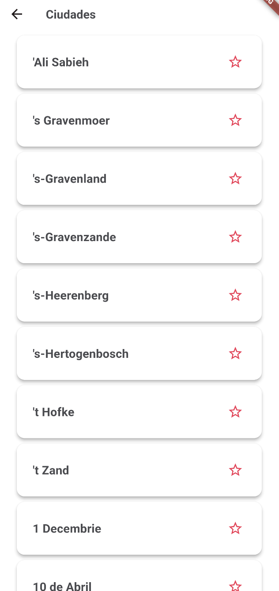
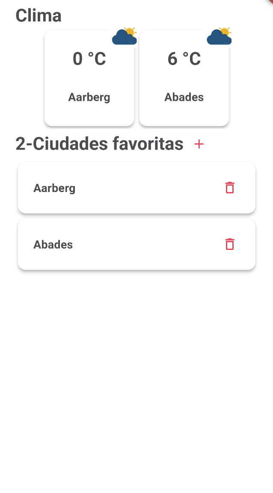

# Android Task Application

This is a Flutter Application to select cities from a list as favorites and know the weather of the city. You can set as favorites cities and remove it. For login you can use any email and password while they have the correct pattern


 
 

## Installation
Clone this repository
```bash
git clone https://github.com/ajidres/
```

## IDE
Import the cloned repo to your preference IDE

## Generating debug APK
In a terminal, locate in the project folder and execute:
1. flutter build apk

## Maintainers
This project is mantained by:
* [Andres Jimenez](https://github.com/ajidres)